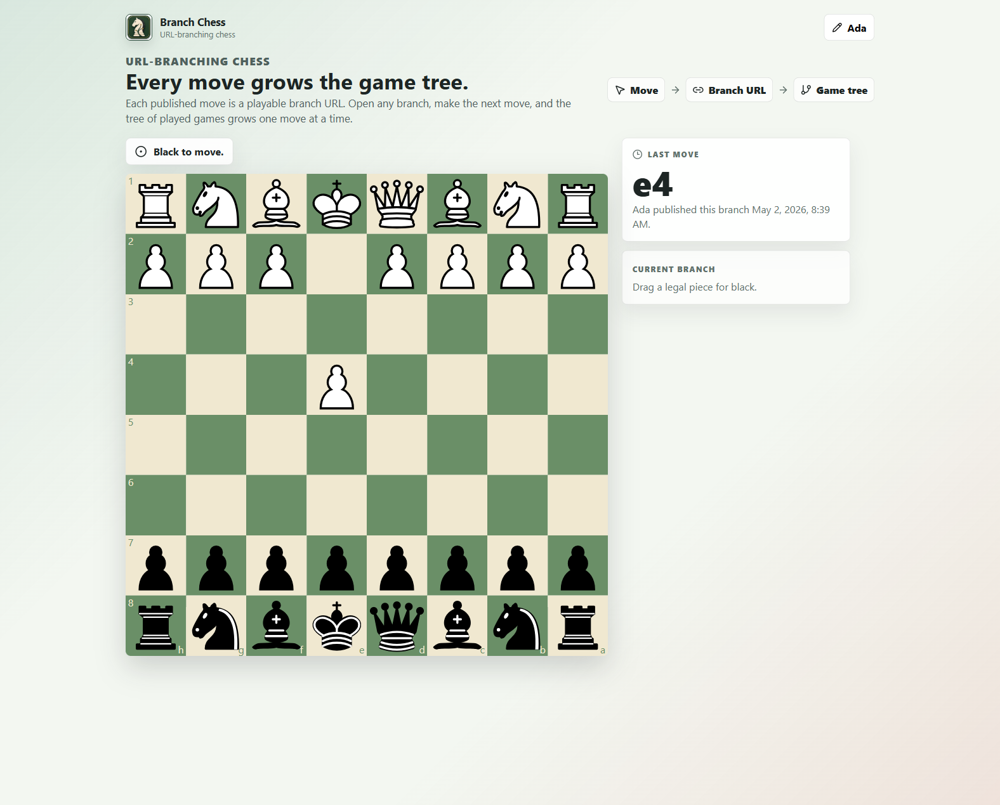

# Branch Chess

[](https://github.com/ThomasRohde/chess/actions/workflows/pages.yml)


Branch Chess is URL-branching chess. Make one legal move, publish it, and the current board becomes a compact share link. Anyone who opens that link can continue from the same position and publish the next branch.

It is a React app with public URL-based play and a Supabase backend for recording published branches. It has no user accounts, cookies, analytics, clocks, or chat. The GitHub Pages build is configured for `/chess/`.

<p align="center">
  
</p>

## Live Demo

[Open Branch Chess on GitHub Pages](https://thomasrohde.github.io/chess/)

Shared positions use hash routes, so a branch URL looks like this:

```text
https://thomasrohde.github.io/chess/#/<packed-position>
```

## Highlights

- Legal chess rules powered by `chess.js`.
- Drag-and-drop and click-to-move board interaction.
- One-move publish flow: move, confirm, publish, share.
- Compact Base64URL payloads stored entirely in the URL fragment.
- Canonical FEN internally, packed binary state externally.
- Promotion picker, check/checkmate/stalemate/draw status, and bad-link handling.
- Copy URL, post-to-X composer links, and generated board image sharing/downloads.
- Local nickname storage only; the nickname is included in links you publish.
- Supabase-backed public branch discovery for games in play and finished games.

## How It Works

1. Start from the initial board or open a branch URL.
2. Choose a nickname.
3. Make one legal move.
4. Confirm and publish the move.
5. Share the generated URL.
6. The next player opens that branch and continues the game tree.

Each published URL restores the playable position, side to move, castling rights, en-passant state, move counters, publisher nickname, timestamp, and latest move metadata.

Published branches are also recorded in Supabase. Open `#/games` to inspect non-final branches that can still be continued, or `#/finished` to inspect terminal branches.

## Quick Start

Requirements:

- Node.js 22
- npm

Install dependencies:

```bash
npm ci
```

Start the development server:

```bash
npm run dev
```

Vite serves the app at a local `/chess/` base path, usually:

```text
http://127.0.0.1:5173/chess/
```

## Supabase Backend

This repository is wired to the Supabase project `branch-chess`:

```text
Project ID: ktbyrionvvfdnuihwclx
URL: https://ktbyrionvvfdnuihwclx.supabase.co
```

Local development reads public client settings from `.env.local`. Use `.env.example` as the template:

```bash
VITE_SUPABASE_URL=https://ktbyrionvvfdnuihwclx.supabase.co
VITE_SUPABASE_PUBLISHABLE_KEY=sb_publishable_...
```

The browser can only read `public.branches`. Publishing goes through the `publish-branch` Edge Function, which validates the branch payload and records the row server-side. The service role key is only used inside the Edge Function.

On publish, the Edge Function silently prunes old finished branch paths when the branch table exceeds the Free-plan retention cap. The default cap is 20,000 rows, with pruning targeting 19,000 rows.

To replace test data with the famous-game seed set, provide the service role key only in your local shell or ignored `.env.local`, then run:

```bash
npm run seed:famous-games -- --confirm-clear-test-data
```

The seed clears `public.branches` and inserts four complete move chains: the Opera Game, Immortal Game, Evergreen Game, and Game of the Century.

Supabase files:

```text
supabase/config.toml
supabase/migrations/20260502090000_create_branches.sql
supabase/migrations/20260503050738_prune_old_finished_branch_paths.sql
supabase/functions/publish-branch/index.ts
```

## Scripts

```bash
npm run dev       # Start the local Vite server
npm run test      # Run unit and component tests with Vitest
npm run test:e2e  # Run Playwright end-to-end tests
npm run build     # Type-check and build the static site
npm run preview   # Preview the production build locally
```

If Playwright browsers are not installed on your machine yet:

```bash
npx playwright install chromium
```

## URL State

Branch Chess keeps FEN as the semantic source of truth and packs shareable state into a binary payload before encoding it as Base64URL without padding. That keeps links short and safe inside URL fragments.

The payload includes:

- Payload version marker
- Side to move
- Castling rights
- En-passant file
- 64-square occupancy and piece masks
- Halfmove and fullmove counters
- Created-at timestamp
- Publisher nickname
- Last move in SAN and UCI

Malformed, oversized, or unsupported payloads are routed to a friendly bad-link screen instead of crashing the app.

## Project Structure

```text
src/
  app/             Router and app entry
  components/      Board, move, nickname, and share UI
  domain/          Chess rules, nickname rules, and URL state codecs
  games/           Supabase branch records, tree building, and subscriptions
  pages/           Play, games-in-play, finished-games, and bad-link pages
  persistence/     Persistence adapter boundary and Supabase publish adapter
  sharing/         Share URL, X composer URL, and board image generation
  storage/         Local nickname storage
supabase/          Database migration and Edge Function source
tests/e2e/         Playwright browser coverage
docs/              README assets
.github/workflows  GitHub Pages deployment workflow
```

## Deployment

Deployment is handled by [`.github/workflows/pages.yml`](.github/workflows/pages.yml).

On pushes to `master` and manual workflow dispatches, GitHub Actions:

1. Installs dependencies with `npm ci`.
2. Installs Playwright Chromium.
3. Runs unit and component tests.
4. Runs Playwright end-to-end tests.
5. Builds the static site.
6. Uploads `dist/` to GitHub Pages.

In the repository settings, set Pages source to **GitHub Actions**.

## V1 Scope

Branch Chess intentionally stays small: no user accounts, PGN export, clocks, chat, AI opponent, or analytics.

A link restores the current playable position and latest published move. Supabase records published branch nodes for discovery, but it does not reconstruct full PGN histories, so exact threefold-repetition claims are outside the v1 scope.

## License

Branch Chess is released under the [MIT License](LICENSE).
